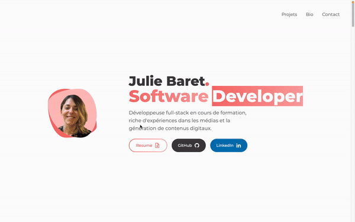

<!-- HEADER -->
# Julie Baret • Portfolio

<!-- TABLE OF CONTENTS -->
<details>
  <summary>Table of Contents</summary>
  <ol>
    <li>
      <a href="#about-the-project">About The Project</a>
      <ul>
        <li><a href="#built-with">Built With</a></li>
      </ul>
    </li>
    <li>
      <a href="#getting-started">Getting Started</a>
      <ul>
        <li><a href="#prerequisites">Prerequisites</a></li>
        <li><a href="#installation">Installation</a></li>
      </ul>
    </li>
    <li><a href="#usage">Usage</a>
      <ul>
        <li><a href="#folder-structure">Folder structure</a></li>
      </ul>
    </li>
    <li><a href="#documentation">Documentation</a></li>
  </ol>
</details>

<!-- ABOUT THE PROJECT -->
## ✨ About the project
<p>
Hi there 👋 I'm super excited to show you one of my first React.js projects : my portfolio !
</p>
<p>
Here at https://juliebaret.vercel.app/
</p>

### Screencapture:
<p align="center">

</p>

### Built with:
- 
- 
- 
<br>

<!-- GETTING STARTED -->
## 🛠 Getting Started
Clone down this repository.

### Prerequisites:
You will need `node` and `npm` installed globally on your machine.  

### Installation:

`npm install` 
<p></p><br>

<!-- USAGE -->
## 🥋 Usage

To launch the project, you'll first have to __start the server__ with this command:

`npm start`  

Then, you'll be able to __visit the app__ at:

`localhost:3000`

### Folder structure:
```
.
├── src .   » Project source code
|       |
|       └── components    » Several components including layouts (Header, Footer, etc.) and containers
|       
├── public    » Public assets
|
├── assets    » Projects overview and screencapture of the app for the README.md file
|
├── README.md   » Current file
|
├── package-lock.json
|
├── package.json
|
├── tailwind.config.js    » Tailwind configuration file
|
└── .gitignore
```
<br>

<!-- DOCUMENTATION -->
## 📚 Documentation
- [Tailwind documentation](https://tailwindcss.com/)
- [React.js documentation](https://beta.reactjs.org/)
